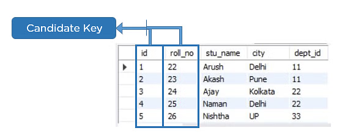

# SQL Interview Prep Repository

## Q1. What is data modeling?

Data modeling is the process of designing the database from scratch by analyzing and defining all the different data types your business collects and produces, as well as the relationships between those bits of data. By using text, symbols, and diagrams, data modeling concepts create visual representations of data as it’s captured, stored, and used at your business. As your business determines how data is used and when, the data modeling process becomes an exercise in understanding and clarifying your data requirements.

## The benefits of data modeling

By modeling your data, you can document what types of data you have, how you use it, and the data management requirements surrounding its usage, protection, and governance. The benefits of data modeling include:

- Creating a structure for collaboration between your IT and business teams.
- Revealing opportunities for improving business processes by defining data needs and uses.
- Saving time and money on IT and process investments through appropriate planning.
- Reducing errors (and error-prone redundant data entry) while improving data integrity.
- Increasing the speed and performance of data retrieval and analytics by planning for capacity and growth.
- Setting and tracking target key performance indicators tailored to your business objectives.

It's not just about the results of data modeling, but how you get those results.

## Data modeling 3 Levels

Now that you know what data modeling is and why it’s important, let’s look at the three different types of data modeling concepts as examples.

### Conceptual data modeling

Conceptual data model
Conceptual data models give a big picture view of data. 

They explain the following:

- What data the system contains
- Data attributes and conditions or constraints on the data
- What business rules the data relates to
- How the data is best organized
- Security and data integrity requirements
- The business stakeholders and analysts typically create the conceptual model. It is a simple diagrammatic representation that does not follow formal data modeling rules. What matters is that it helps both technical and nontechnical stakeholders to share a common vision and agree on the purpose, scope, and design of their data project.

### Logical data modeling

Logical data models map the conceptual data classes to technical data structures. They give more details about the data concepts and complex data relationships that were identified in the conceptual data model, such as these:

- Data types of the various attributes (for example, string or number)
- Relationships between the data entities
- Primary attributes or key fields in the data
- Data architects and analysts work together to create the logical model. They follow one of several formal data modeling systems to create the representation. Sometimes agile teams might choose to skip this step and move from conceptual to physical models directly. However, these models are useful for designing large databases, called data warehouses, and for designing automatic reporting systems.

### Physical data modeling

Physical data models map the logical data models to a specific DBMS technology and use the software’s terminology. For example, they give details about the following:

- Data field types as represented in the DBMS
- Data relationships as represented in the DBMS
- Additional details, such as performance tuning
- Data engineers create the physical model before final design implementation. They also follow formal data modeling techniques to make sure that they have covered all aspects of the design.

## Q2. How data modeling concepts impact analytics ?

Data modeling, data science, and data analytics all go hand-in-hand—you need a quality data model to get the most impactful data analytics for effectual business intelligence that'll inform your future decision-making. The process of creating a data model involves forcing each business unit to look at how they contribute to their holistic organizational goals. Plus, a solid data model means optimized analytics performance, no matter how large and complex your data estate is—or will become.

With all your data clearly defined, analyzing exactly the data you need becomes much easier. Because you’ve already set up the relationships between data attributes within your data model, it’s simple to analyze and see impacts as you change processes, prices, or staffing.

## Q3. What is Normalization in SQL? 1NF, 2NF, 3NF ?

Normalization is the process to eliminate data redundancy and enhance data integrity in the table. Normalization also helps to organize the data in the database. It is a multi-step process that sets the data into tabular form and removes the duplicated data from the relational tables.

Normalization organizes the columns and tables of a database to ensure that database integrity constraints properly execute their dependencies. It is a systematic technique of decomposing tables to eliminate data redundancy (repetition) and undesirable characteristics like Insertion, Update, and Deletion anomalies.

# 1st Normal Form (1NF):
- A table is referred to as being in its First Normal Form if atomicity of the table is 1.
- Here, atomicity states that a single cell cannot hold multiple values. It must hold only a single-valued attribute.
- The First normal form disallows the multi-valued attribute, composite attribute, and their combinations.
Now you will understand the First Normal Form with the help of an example.

Below is a students’ record table that has information about student roll number, student name, student course, and age of the student.

In the studentsrecord table, you can see that the course column has two values. Thus it does not follow the First Normal Form. Now, if you use the First Normal Form to the above table, you get the below table as a result.

By applying the First Normal Form, you achieve atomicity, and also every column has unique values.

Before proceeding with the Second Normal Form, get familiar with Candidate Key and Super Key.

## Candidate Key
A candidate key is a set of one or more columns that can identify a record uniquely in a table, and YOU can use each candidate key as a Primary Key.

Now, let’s use an example to understand this better.

## Super Key
Super key is a set of over one key that can identify a record uniquely in a table, and the Primary Key is a subset of Super Key.

Let’s understand this with the help of an example.

# Second Normal Form (2NF)
The first condition for the table to be in Second Normal Form is that the table has to be in First Normal Form. The table should not possess partial dependency. The partial dependency here means the proper subset of the candidate key should give a non-prime attribute.

Now understand the Second Normal Form with the help of an example.

Consider the table Location:

The Location table possesses a composite primary key cust_id, storeid. The non-key attribute is store_location. In this case, store_location only depends on storeid, which is a part of the primary key. Hence, this table does not fulfill the second normal form.

To bring the table to Second Normal Form, you need to split the table into two parts. This will give you the below tables:

As you have removed the partial functional dependency from the location table, the column store_location entirely depends on the primary key of that table, storeid.

Now that you understood the 1st and 2nd Normal forms, you will look at the next part of this Normalization in SQL tutorial.

# Third Normal Form (3NF)
- The first condition for the table to be in Third Normal Form is that the table should be in the Second Normal Form.
- The second condition is that there should be no transitive dependency for non-prime attributes, which indicates that non-prime attributes (which are not a part of the candidate key) should not depend on other non-prime attributes in a table. Therefore, a transitive dependency is a functional dependency in which A → C (A determines C) indirectly, because of A → B and B → C (where it is not the case that B → A).
- The third Normal Form ensures the reduction of data duplication. It is also used to achieve data integrity.
Below is a student table that has student id, student name, subject id, subject name, and address of the student as its columns.

In the above student table, stu_id determines subid, and subid determines sub. Therefore, stu_id determines sub via subid. This implies that the table possesses a transitive functional dependency, and it does not fulfill the third normal form criteria.

Now to change the table to the third normal form, you need to divide the table as shown below:

As you can see in both the tables, all the non-key attributes are now fully functional, dependent only on the primary key. In the first table, columns name, subid, and addresses only depend on stu_id. In the second table, the sub only depends on subid.

## Q3. Difference between char, varchar, and nvarchar in SQL Server

## Char DataType
The `char` datatype is used to store a fixed length of characters. Suppose we declared `char(50)`, it will allocate memory for 50 characters. If we insert only 10 characters into `char(50)`, only 10 characters of memory will be used and the remaining 40 characters of memory will be wasted.

## varchar DataType
`varchar` means variable characters and is used to store non-unicode characters. It allocates memory based on the number of characters inserted. Suppose we declared `varchar(50)`, it will allocate memory for 0 characters at the time of declaration. If we insert only 10 characters into `varchar(50)`, it will allocate memory for only those 10 characters.

## nvarchar DataType
`nvarchar` is similar to `varchar`, but it is used to store Unicode characters and allows you to store multiple languages in the database. `nvarchar` will take twice as much space to store the extended set of characters required by other languages. If you are not using other languages, it’s better to use `varchar` instead of `nvarchar`.

# Difference between bit, tinyint, smallint, int, and bigint datatypes in SQL Server

## Bit DataType
This datatype represents a single bit that can be 0 or 1.

## tinyint DataType
This datatype represents a single byte which is used to store values from 0 to 255 (MinVal: 0, MaxVal: 255). Its storage size is 1 byte.

## smallint DataType
This datatype represents a signed 16-bit integer which is used to store values from -2^15 (-32,768) through 2^15 - 1 (32,767). Its storage size is 2 bytes.

## int DataType
This datatype represents a signed 32-bit integer which is used to store values from -2^31 (-2,147,483,648) to 2^31-1 (2,147,483,647). Its storage size is 4 bytes.

## Bigint DataType
This datatype represents a signed 64-bit integer which is used to store values from -2^63 (-9223372036854775808) through 2^63-1 (9223372036854775807). Its storage size is 8 bytes.
